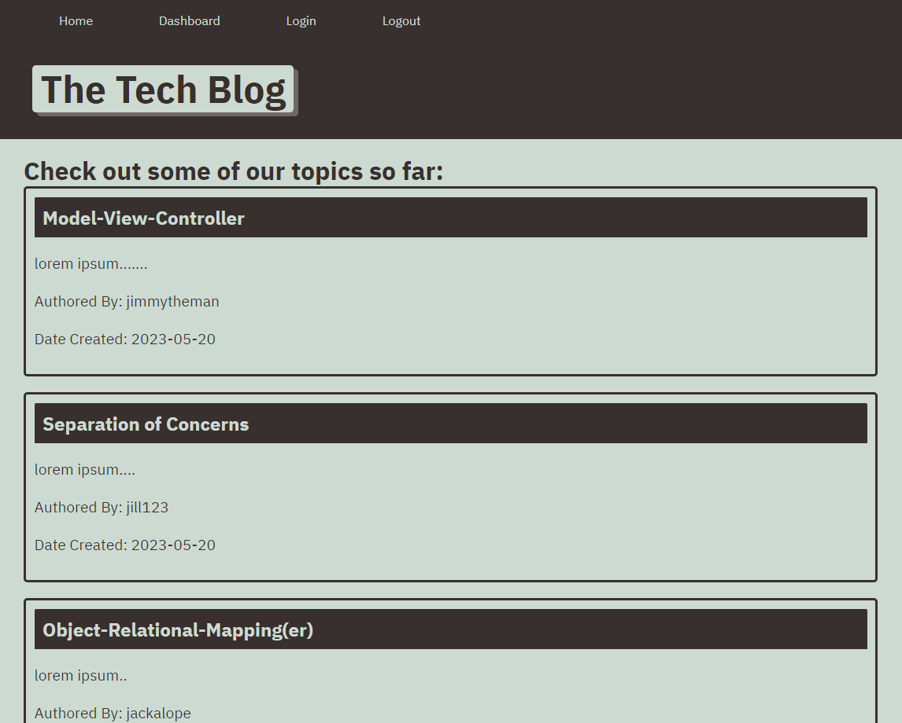
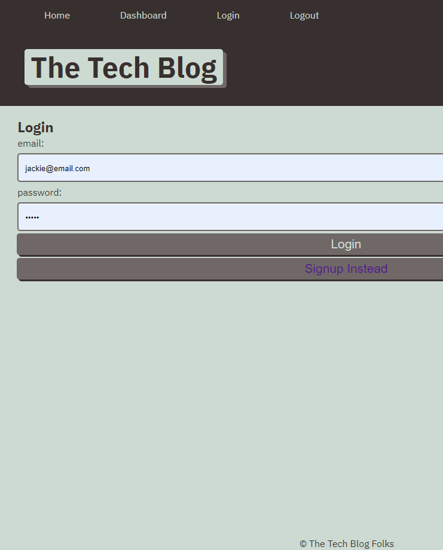
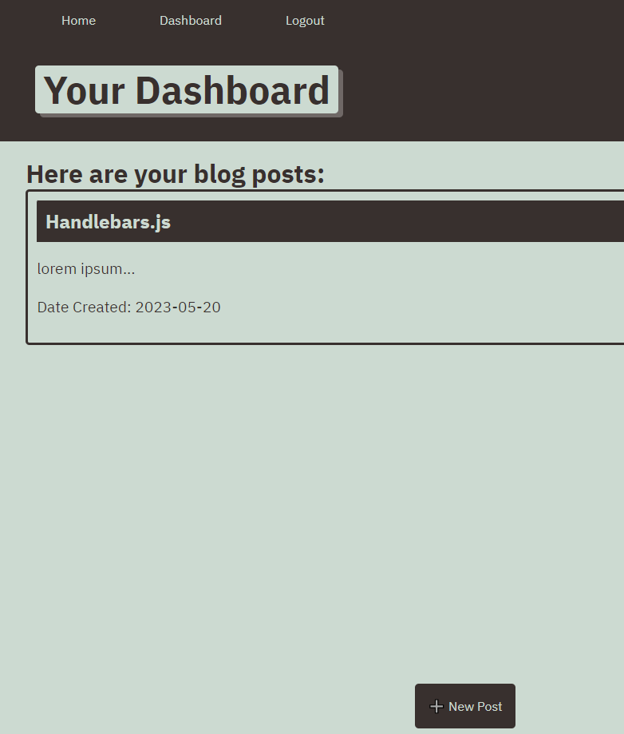

# Tech-Blog

## Description
My motivation for this project was to continue my ventures into a full MVC-based stack by incorporating a template engine called Handlebars.js as the "views" component.
I decided to build a simple blog app because it's a straightforward way to demonstrate the power of templating engines, routing and database operations.
This project essentially would solve the issue of finding a space where thoughts - namely those involving programming - can be jotted down and saved to a user's account, then displayed for those visiting the site in the future.
In building this small app I learned the benefits of using a template engine (handlebars.js), and I also furthered my understanding of the MVC paradigm, of course referring to the model-view-controller state and how, though modular, they complement each other and come together to produce fluid web applications.
## Table of Contents
### [Installation](#installation)
### [Usage](#usage)
### [Screenshots](#screenshots)
### [Contributions](#contributions)
### [Tests](#tests)
### [Questions](#questions)
### [License](#license)
## Installation
This is a fully deployed app on Heroku, and my be accessed at any time by visiting: https://mighty-depths-57818.herokuapp.com/.
## Usage
The user may browse the website at their leisure; however, in order to make a blog post the user will have to register with an email and password.
## Screenshots

## Contributions
There were no outside collaborators involved with this particular project.

The third-party assets that were used for this project include the following Node packages: Express, sessions, bcrypt, handlebars.js. Other third-party assets include Bootstrap for styling, and MySQL for databasing.
No tutorials were used in the design of this project.
## Tests
No specific tests were run for this project apart from basic running of the program to ensure proper functionality.

## Questions
Please direct any further questions to: buster35 or gilb9711@gmail.com.
## License
The license used for this project is MIT: https://choosealicense.com/licenses/mit/#.
